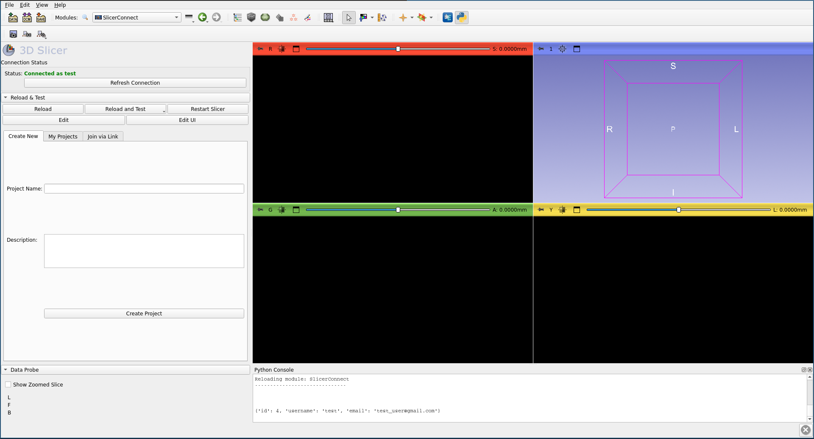

# SlicerConnect: Real-Time Collaborative Segmentation

SlicerConnect is a 3D Slicer extension designed to enable "Google Docs-style" collaboration for medical image segmentation. It allows multiple researchers or clinicians to work on the same segmentation simultaneously, synchronizing edits in real-time across different locations.

## Quick Start Guide
**Prerequisites**: Ensure you have a stable internet connection.

### Testing with Sample Data
To test the collaborative features without using your own clinical data:
1. Open the **Sample Data** module (built into 3D Slicer).
2. Select **MRHead**. Slicer will automatically download and load this standard brain MRI volume.
3. You can then use this volume to start a SlicerConnect session.

### 1. Authentication
* Open the **SlicerConnectLogin** module.
* Enter your credentials and click **Login**. 
* *Note: On first run, Slicer may briefly pause to install the `requests` library.*

### 2. Creating a Collaborative Session
* Once logged in, switch to the **SlicerConnect** module.
* Click **Create New Project** or select an existing one from the list.
* Load your base volume (e.g., from the Slicer "Sample Data" module).
* Click **Start Session**. This will initialize the synchronization engine.
* Share the Project ID with your collaborators so they can join.
* *Note: On first run, Slicer may briefly pause to install the `websockets` library.*

## Privacy & Data Security
**SlicerConnect** is a cloud-based collaborative tool. Please be aware of the following:
* **Data Hosting**: Segmentation data (voxels and deltas) are transmitted to and temporarily stored on our synchronization server at `https://slicerconnect.from-delhi.net`.
* **Encryption**: All communication is performed over HTTPS and Secure WebSockets (WSS).
* **Compliance**: Ensure you have the necessary institutional approvals before uploading Protected Health Information (PHI) or de-identify your images before use.

## Extension Structure

The extension consists of three specialized modules that manage the lifecycle of a collaborative session:

### SlicerConnectLogin

- Handles secure user authentication.
- Exchanges credentials for a session token from the central server.
- Ensures encrypted communication for all subsequent steps.

### SlicerConnect

The Project Hub of the extension.

- Implements Role-Based Access Control (RBAC) to manage user permissions.
- Displays available projects and active collaborators.
- Handles the initial download/sync of the volume data.

### SlicerConnectEditor

The Real-Time Engine.

- Hooks directly into Slicer's Segment Editor.
- Broadcasts local voxel changes (deltas) and applies incoming edits from remote users.
- Optimized with zlib compression and debounced updates for smooth performance.

## Installation & Setup

### Prerequisites

- 3D Slicer (Stable or Preview).
- Python Dependencies: `numpy`, `websockets`, and `requests` (installed via Slicer's Python console if not present).
- Backend Server: A running SlicerConnect WebSocket/API server.

### Installation

Clone this repository to your local machine:

```
git clone https://github.com/pka420/SlicerConnect.git
```

1. Open 3D Slicer.
2. Navigate to **Edit -> Application Settings -> Modules**.
3. Click **Add** and select the root `SlicerConnect` folder.
4. Restart Slicer to initialize the modules.

## Architecture Highlights

- **Voxel Delta Sync:** Instead of sending full volumes, SlicerConnect only transmits changed voxels to save bandwidth.
- **Stateful Recovery:** The server maintains the "Source of Truth," allowing new users to join an ongoing session and receive the current state immediately.
- **Event Guarding:** Prevents "Echo Loops" by distinguishing between local user edits and incoming remote updates.

---

# Collaborative Segmentation Sync Protocol

## 1. Data Pipeline Overview

The system uses a Master-Client or Peer-to-Peer model where segmentation changes are synchronized via two types of messages:

- **Full Sync:** Sends the entire labelmap (used for initialization or large changes).
- **Delta Sync:** Sends only the modified voxels (used for real-time brush strokes).

### Coordinate Systems

To ensure "Placement" is preserved, we map data across three spaces:

- **Numpy Space:** `(Z, Y, X)` indexed array.
- **IJK Space:** `(X, Y, Z)` voxel indices in Slicer.
- **RAS Space:** `(Right, Anterior, Superior)` physical millimeters in the 3D world.

## 2. Sending Segmentations

### Full Segmentation Transfer

When a full sync is triggered, the module exports the `vtkMRMLSegmentationNode` to a temporary `vtkMRMLLabelMapVolumeNode`.

**Process:**

1. **Export:** Convert the segmentation to a labelmap to flatten all segments into a single 3D array.
2. **Metadata Extraction:** Capture the Origin, Spacing, and IJKToRAS Direction Matrix.
3. **Compression:** Convert the volume to a Numpy array. Compress using zlib and encode to base64 for JSON transport.

**Payload Structure:**

```json
{
  "type": "full_segmentation",
  "data": {
    "array": "base64_string",
    "sessionHash": "hash of current array that we are sending",
    "origin": [x, y, z],
    "spacing": [sx, sy, sz],
    "direction": [m00, m01, "...", m33],
    "dimensions": [w, h, d],
    "timestamp": datetime
  }
}
```

### Delta Updates

Deltas are sent during active interaction (e.g., `python checkBrushStrokes`).

**Process:**

1. **Identify Changes:** Capture only the indices $(i, j, k)$ and the new values $v$ that changed since the last update.
2. **Encoding:** Use `numpy.frombuffer` to convert indices to a byte stream.
3. **Payload:** Contains the specific sparse coordinates and the same geometry metadata to ensure the "canvas" matches on both ends.

## 3. Applying Segmentations (Receiver Side)

The receiver must reconstruct the physical "placement" before painting the pixels.

### Step A: Geometry Alignment

The `_getOrCreateMasterLabelmap` function ensures a "Proxy Volume" exists with the correct orientation:

- Sets `node.SetOrigin()` and `node.SetSpacing()`.
- Applies the 4x4 Direction Matrix via `SetIJKToRASMatrix()`. This ensures that even if the image is tilted (oblique), the pixels land in the correct anatomical location.

### Step B: The Data Bridge (Numpy to VTK)

To avoid UI lag and "Invalid Labelmap" errors, we bypass standard Slicer utilities and talk directly to VTK memory:

- **Memory Allocation:** Create a `vtkOrientedImageData` object.
- **Extent Definition:** Use `SetExtent(0, X-1, 0, Y-1, 0, Z-1)` to define the voxel grid boundaries.
- **Direct Copy:** Use `vtk.util.numpy_support.numpy_to_vtk` to pour the received Numpy array into the VTK scalar pointer.

### Step C: Segment Injection

Rather than re-importing the whole volume (which is slow), we update specific segments:

1. Extract a Binary Mask for each `labelValue` (e.g., `array == 1`).
2. Assign the `orientedMask` (with its geometry) to the specific `vtkSegment`.
3. Trigger `OnSegmentModified()` to refresh the Slicer 3D and 2D views.

## 4. Key Logic Components

| Component | Responsibility |
|---|---|
| `SlicerConnectLogic` | Manages WebSocket state and triggers cleanup to prevent "ghost" connections. |
| `_getOrCreateMasterLabelmap` | Maintains a persistent MRML node to store incoming pixel data across reloads. |
| `_applyArrayToSegmentation` | The core engine that converts Numpy arrays into physical VTK segments. |
| `vtkOrientedImageData` | The internal Slicer data structure that stores the Direction Matrix alongside the pixels. |

## Screenshots:



## How to Cite
If you use SlicerConnect in your research, please cite:
> Author Name, et al. "SlicerConnect: Real-time Collaborative Segmentation." *Journal Name*, Year. [DOI: 10.xxxx/xxxx]

## References
This extension builds upon several open-source technologies:
* **3D Slicer**: [https://www.slicer.org/](https://www.slicer.org/)
* **websockets**: Used for real-time synchronization between clients. [https://github.com/python-websockets/websockets](https://github.com/python-websockets/websockets)
* **Requests**: Used for secure authentication with the backend API.
